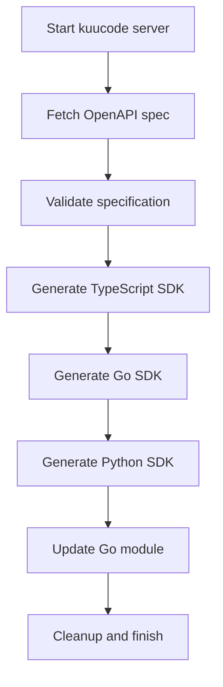

# SDK Generation Documentation

This document provides comprehensive information about generating client SDKs for the Kuucode API using OpenAPI Generator.

## Table of Contents

- [Overview](#overview)
- [Quick Start](#quick-start)
- [Architecture](#architecture)
- [Configuration](#configuration)
- [Generated SDKs](#generated-sdks)
- [Development Workflow](#development-workflow)
- [Publishing](#publishing)
- [Troubleshooting](#troubleshooting)
- [Migration from Stainless](#migration-from-stainless)

## Overview

Kuucode uses [OpenAPI Generator](https://openapi-generator.tech/) to automatically generate client SDKs from the REST API specification. This provides:

- **Free and open source** solution
- **Full local control** over SDK generation
- **Support for 50+ programming languages**
- **Customizable templates and configuration**
- **No external service dependencies**

### Supported SDKs

| Language   | Output Directory        | Package Name        | Repository                              |
|------------|------------------------|--------------------|-----------------------------------------|
| TypeScript | `./sdks/typescript/`   | `@kuucode-ai/sdk`  | `moikas-code/kuucode-sdk-js`           |
| Go         | `./packages/tui/sdk/`  | `kuucode`          | `moikas-code/kuucode-sdk-go`           |
| Python     | `./sdks/python/`       | `kuucode_ai`       | `moikas-code/kuucode-sdk-python`       |

## Quick Start

### Prerequisites

- **Node.js** 18+ or **Bun**
- **Go** 1.21+ (for Go SDK)
- **Python** 3.8+ (for Python SDK)
- **curl** and **jq** (for validation)

### Generate All SDKs

```bash
# Clone and setup
git clone https://github.com/moikas-code/kuucode.git
cd kuucode
bun install

# Generate all SDKs
./scripts/generate-sdks
```

### Development Mode

```bash
# Faster generation, skips production builds
./scripts/generate-sdks --dev
```

### Clean Build

```bash
# Remove previous builds before generating
./scripts/generate-sdks --clean
```

## Architecture

### Generation Process



### File Structure

```
kuucode/
├── scripts/
│   └── generate-sdks              # Main generation script
├── config/
│   ├── typescript-config.json    # TypeScript SDK config
│   ├── go-config.json            # Go SDK config
│   └── python-config.json        # Python SDK config
├── sdks/
│   ├── typescript/               # Generated TypeScript SDK
│   └── python/                   # Generated Python SDK
├── packages/
│   └── tui/
│       └── sdk/                  # Generated Go SDK (committed)
└── openapi.json                  # Generated API specification
```

## Configuration

### TypeScript SDK Configuration

**File**: `config/typescript-config.json`

```json
{
  "npmName": "@kuucode-ai/sdk",
  "npmVersion": "0.1.0",
  "npmRepository": "https://github.com/moikas-code/kuucode-sdk-js",
  "supportsES6": true,
  "withInterfaces": true,
  "typescriptThreePlus": true,
  "modelPropertyNaming": "camelCase",
  "enumPropertyNaming": "UPPERCASE"
}
```

**Key Options**:
- `npmName`: Package name for npm registry
- `supportsES6`: Enable ES6+ features
- `withInterfaces`: Generate TypeScript interfaces
- `modelPropertyNaming`: Property naming convention

### Go SDK Configuration

**File**: `config/go-config.json`

```json
{
  "packageName": "kuucode",
  "packageVersion": "0.1.0",
  "gitUserId": "moikas-code",
  "gitRepoId": "kuucode-sdk-go",
  "moduleName": "github.com/moikas-code/kuucode-sdk-go",
  "generateInterfaces": true,
  "structPrefix": true,
  "enumClassPrefix": true
}
```

**Key Options**:
- `moduleName`: Go module path
- `generateInterfaces`: Create interface types
- `structPrefix`: Add prefixes to struct names
- `enumClassPrefix`: Add prefixes to enum types

### Python SDK Configuration

**File**: `config/python-config.json`

```json
{
  "packageName": "kuucode_ai",
  "projectName": "kuucode-ai",
  "packageVersion": "0.1.0",
  "gitUserId": "moikas-code",
  "gitRepoId": "kuucode-sdk-python",
  "packageUrl": "https://github.com/moikas-code/kuucode-sdk-python",
  "generateSourceCodeOnly": false
}
```

**Key Options**:
- `packageName`: Python package name (snake_case)
- `projectName`: PyPI project name (kebab-case)
- `generateSourceCodeOnly`: Include setup.py and other files

## Generated SDKs

### TypeScript SDK

**Location**: `./sdks/typescript/`

**Usage Example**:
```typescript
import { Configuration, DefaultApi } from '@kuucode-ai/sdk';

const config = new Configuration({
  basePath: 'http://localhost:4096'
});

const api = new DefaultApi(config);
const sessions = await api.sessionList();
```

**Features**:
- TypeScript interfaces and types
- Fetch-based HTTP client
- Promise-based async API
- ES6+ module support

### Go SDK

**Location**: `./packages/tui/sdk/`

**Usage Example**:
```go
import "github.com/moikas-code/kuucode-sdk-go"

client := kuucode.NewClient()
sessions, err := client.Session.List(context.TODO())
if err != nil {
    log.Fatal(err)
}
```

**Features**:
- Idiomatic Go interfaces
- Context support
- Error handling
- Struct-based models

### Python SDK

**Location**: `./sdks/python/`

**Usage Example**:
```python
import kuucode_ai
from kuucode_ai.rest import ApiException

configuration = kuucode_ai.Configuration(
    host = "http://localhost:4096"
)

with kuucode_ai.ApiClient(configuration) as api_client:
    api_instance = kuucode_ai.DefaultApi(api_client)
    sessions = api_instance.session_list()
```

**Features**:
- Type hints support
- Async/await support
- Exception handling
- Pydantic models

## Development Workflow

### 1. Making API Changes

When modifying the API in `packages/kuucode/src/server/server.ts`:

```typescript
// Example: Adding a new endpoint
app.get('/api/v1/new-endpoint', async (c) => {
  return c.json({ message: 'Hello from new endpoint' })
})
```

### 2. Regenerating SDKs

```bash
# Development mode (recommended during development)
./scripts/generate-sdks --dev

# Full generation (for production)
./scripts/generate-sdks
```

### 3. Testing Changes

**Go SDK** (automatically used by TUI):
```bash
cd packages/tui
go run . # Uses local SDK
```

**TypeScript SDK**:
```bash
cd sdks/typescript
npm link
# Use in your project with: npm link @kuucode-ai/sdk
```

**Python SDK**:
```bash
cd sdks/python
pip install -e .
# Now available as: import kuucode_ai
```

### 4. Validation

The generation script includes automatic validation:

```bash
# Manual validation
jq empty openapi.json  # Validate JSON syntax
openapi-generator-cli validate -i openapi.json  # Validate OpenAPI spec
```

## Publishing

### TypeScript SDK to npm

```bash
cd sdks/typescript

# Update version
npm version patch

# Publish
npm publish
```

### Go SDK to GitHub

```bash
# The Go SDK should be committed to the main repository
git add packages/tui/sdk/
git commit -m "Update Go SDK"

# For separate repository:
cd /path/to/kuucode-sdk-go
cp -r /path/to/kuucode/packages/tui/sdk/* .
git add .
git commit -m "Update SDK"
git tag v0.1.0
git push origin main --tags
```

### Python SDK to PyPI

```bash
cd sdks/python

# Build distribution
python setup.py sdist bdist_wheel

# Upload to PyPI
twine upload dist/*
```

## Troubleshooting

### Common Issues

#### 1. OpenAPI Generator Not Found

**Error**: `openapi-generator-cli: command not found`

**Solution**:
```bash
# Install globally
npm install -g @openapitools/openapi-generator-cli

# Or use npx
npx @openapitools/openapi-generator-cli version
```

#### 2. Server Won't Start

**Error**: `Error: listen EADDRINUSE :::4096`

**Solution**:
```bash
# Check what's using port 4096
lsof -i :4096

# Kill the process or use a different port
./scripts/generate-sdks --port 4097
```

#### 3. Invalid OpenAPI Specification

**Error**: `Invalid OpenAPI spec generated`

**Solution**:
```bash
# Check the generated spec
cat openapi.json | jq .

# Validate manually
openapi-generator-cli validate -i openapi.json

# Check server logs
bun run packages/kuucode/src/index.ts serve --port 4096
```

#### 4. Go Module Issues

**Error**: `go: module github.com/moikas-code/kuucode-sdk-go: not found`

**Solution**:
```bash
cd packages/tui/sdk
go mod init github.com/moikas-code/kuucode-sdk-go
go mod tidy
```

#### 5. TypeScript Compilation Errors

**Error**: TypeScript compilation fails in generated SDK

**Solution**:
```bash
# Check TypeScript configuration
cd sdks/typescript
npx tsc --noEmit

# Update config if needed
vim config/typescript-config.json
```

### Debug Mode

Enable verbose logging:

```bash
# Set debug environment variable
DEBUG=1 ./scripts/generate-sdks --dev

# Or modify the script to add --verbose flag to openapi-generator-cli
```

### Validation Tools

```bash
# Validate OpenAPI spec
openapi-generator-cli validate -i openapi.json

# Check JSON syntax
jq empty openapi.json

# Lint the specification
spectral lint openapi.json
```

## Migration from Stainless

### What Changed

| Aspect | Stainless | OpenAPI Generator |
|--------|-----------|-------------------|
| **Cost** | $99/month | Free |
| **Control** | External service | Local generation |
| **Languages** | Limited | 50+ supported |
| **Customization** | Limited | Full template control |
| **Dependencies** | API key required | Self-contained |

### Backward Compatibility

The old Stainless command still works:

```bash
# This still works (aliased to generate-sdks)
./scripts/stainless

# Equivalent to
./scripts/generate-sdks
```

### Configuration Migration

Stainless configuration in `stainless.yml` has been replaced with individual JSON config files:

- `stainless.yml` → `config/typescript-config.json`
- `stainless.yml` → `config/go-config.json`  
- `stainless.yml` → `config/python-config.json`

### Feature Parity

| Feature | Stainless | OpenAPI Generator | Status |
|---------|-----------|-------------------|---------|
| TypeScript SDK | ✅ | ✅ | ✅ Complete |
| Go SDK | ✅ | ✅ | ✅ Complete |
| Python SDK | ✅ | ✅ | ✅ Complete |
| Auto-publishing | ✅ | Manual | ⚠️ Manual process |
| Documentation | ✅ | ✅ | ✅ Complete |
| Validation | ✅ | ✅ | ✅ Complete |

### Benefits of Migration

1. **Cost Savings**: $99/month → $0
2. **Independence**: No external service dependencies
3. **Flexibility**: Full control over generation process
4. **Transparency**: Open source tooling
5. **Customization**: Template and configuration control

## Advanced Usage

### Custom Templates

You can customize the generated code using custom templates:

```bash
# Download default templates
openapi-generator-cli author template -g typescript-fetch -o ./templates/typescript

# Modify templates in ./templates/typescript/
# Use custom templates
openapi-generator-cli generate \
  -i openapi.json \
  -g typescript-fetch \
  -t ./templates/typescript \
  -o ./sdks/typescript
```

### Additional Languages

Generate SDKs for other languages:

```bash
# List available generators
openapi-generator-cli list

# Generate Rust SDK
openapi-generator-cli generate \
  -i openapi.json \
  -g rust \
  -o ./sdks/rust \
  --package-name kuucode_rs
```

### CI/CD Integration

Example GitHub Actions workflow:

```yaml
name: Generate SDKs
on:
  push:
    paths: ['packages/kuucode/src/server/**']

jobs:
  generate-sdks:
    runs-on: ubuntu-latest
    steps:
      - uses: actions/checkout@v3
      - uses: oven-sh/setup-bun@v1
      - run: bun install
      - run: ./scripts/generate-sdks
      - name: Commit changes
        run: |
          git config --local user.email "action@github.com"
          git config --local user.name "GitHub Action"
          git add packages/tui/sdk/
          git commit -m "Auto-update Go SDK" || exit 0
          git push
```

## Support

For issues with SDK generation:

1. **Check this documentation** for common solutions
2. **Review the troubleshooting section** above
3. **Open an issue** at [moikas-code/kuucode/issues](https://github.com/moikas-code/kuucode/issues)
4. **Check OpenAPI Generator docs** at [openapi-generator.tech](https://openapi-generator.tech/)

---

*Last updated: January 2025*